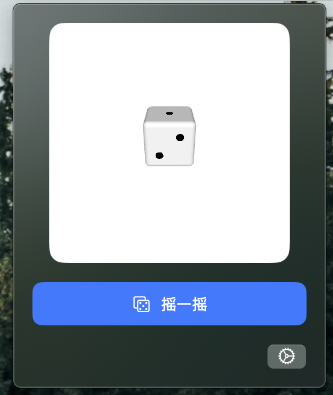
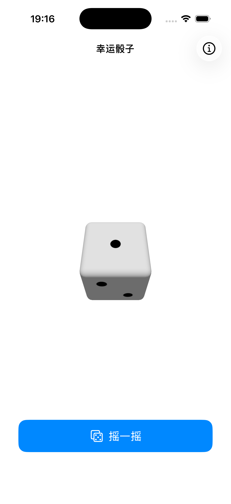

# 幸运骰子

一个简洁的 3D 骰子应用，支持 macOS 状态栏和 iOS 设备。

## 下载安装

### macOS

[下载最新版本](https://github.com/Hao-yiwen/dice/releases/) — DMG 已通过 Apple Developer ID 签名和公证，下载后直接使用。

### iOS

[App Store 下载](https://apps.apple.com/app/TODO) (即将上架)

## 功能特点

- 精美 3D 骰子渲染
- 点击按钮或摇一摇掷骰子
- iOS 小组件支持，一键直达
- 完全离线，无广告，不收集任何数据
- 支持中英文

## 安装说明

### macOS

1. 下载 DiceGenerator.dmg
2. 打开 DMG 文件
3. 将应用拖入 Applications 文件夹

### iOS

1. 从 App Store 下载安装
2. 或克隆项目代码，使用 Xcode 打开并构建运行

## 系统要求

- macOS 13.0 或更高版本
- iOS 17.0 或更高版本

## 预览

## 支持我的工作

如果这个项目对你有帮助，可以请我喝杯咖啡 ☕️

  

 

